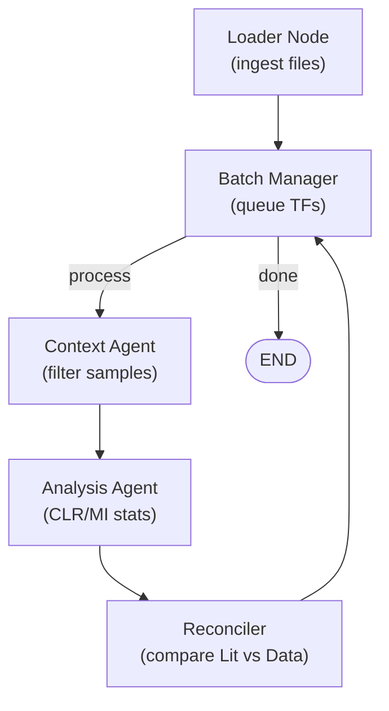

[1 tool called]

Here's a rewritten `README.md` that describes the LangGraph Agentic Reconciliation System you have actually implemented, focusing on real code and project details. This version matches your codebase structure and capabilities built so far:

---

# DREAMing Agent: Automated Reconciliation of Biological Literature and High-Throughput Data

This project implements an **autonomous agentic system** for reconciling curated literature knowledge (RegulonDB) with high-throughput expression data (M3D), leveraging the LangGraph cyclic workflow engine and advanced statistics.

**Key Goals:**
- Validate, contradict, or discover gene regulatory relationships in *E. coli*
- Bridge bottom-up (literature) and top-down (omics) worlds
- Output validated, pruned, and novel regulatory hypotheses

---

## System Overview

`LangGraph` controls a **cyclic state-machine** workflow operating on batches of transcription factors (TFs):



Each round:
1. **Loader Node:** Loads RegulonDB, M3D, and gene mappings
2. **Batch Manager:** Queues up TFs (in batches) for processing
3. **Context Agent:** Contextually filters experiments for current TF(s)
4. **Analysis Agent:** Calculates mutual information & CLR-corrected scores for all TF→Gene pairs
5. **Reconciler:** Applies rules to update reconciliation log:
   - Validated
   - Condition-Silent
   - Probable False Positive
   - Novel Hypothesis

---

## Project Structure

```
DREAMingAgent/
├── main.py                  # Main entry point for pipeline
├── requirements.txt         # All dependencies
├── src/
│   ├── workflow.py          # Workflow orchestration (LangGraph)
│   ├── state.py             # AgentState schema, data classes
│   ├── nodes/
│   │   ├── loader.py        # Node 1: Data ingest
│   │   ├── batch_manager.py # Node 2: Batch TF queue
│   │   ├── context_agent.py # Node 3: Metadata/sample filter
│   │   ├── analysis_agent.py# Node 4: Mutual Info, CLR stats
│   │   └── reconciler.py    # Node 5: Literature vs Data reasoning
│   └── utils/
│       ├── parsers.py       # Data parsers and mock/synthetic data
│       └── statistics.py    # Statistical computation helpers
├── examples/
│   └── demo_analysis_agent.py # Demo: MI/CLR in action
├── tests/
│   └── test_analysis_agent.py # Unit tests
└── output/, logs/, .pytest_cache/ (gitignored)
```

---

## Data Inputs

- **RegulonDB**: `network_tf_gene.txt` (TF-Gene edges, effects, evidence), `gene_product.txt` (ID mapping)
- **M3D**: `E_coli_v4_Build_6_exps.tab` (expression), `E_coli_v4_Build_6_meta.tab` (metadata)
- **Synthetic data option:** Full pipeline demo—no real files needed

---

## Core Analysis: CLR/MI

- **Mutual Information (MI)** between TF and all genes (using sklearn's nearest-neighbor estimator)
- **Context Likelihood of Relatedness (CLR):** Z-score normalization against MI background; distinguishes direct/indirect links and handles "sticky" genes.
  - \( z = \max(0, \frac{\text{MI} - \mu}{\sigma}) \)
- Rules distinguish:
  - **Validated** edge: strong lit + strong data
  - **Silent**: strong lit, but no data support (context-gap)
  - **False positive**: weak lit, and no data
  - **Novel**: strong new data, not in literature

---

## Running the System

### Dependencies

```bash
pip install -r requirements.txt
```

### Quickstart (Synthetic Test)

```bash
python main.py --synthetic --output output/
```
- Will generate demo data, run full graph, and export results.

### With Real Data

```bash
python main.py \
  --network data/network_tf_gene.txt \
  --genes data/gene_product.txt \
  --expression data/E_coli_v4_Build_6_exps.tab \
  --metadata data/E_coli_v4_Build_6_meta.tab \
  --output results/
```

### Outputs

- `output/reconciled_network.tsv` — master network, each edge annotated with:
  - Literature evidence, CLR Z-score, data support, reconciliation status, context tags
- `output/reconciliation_results.json` — full reconciliation, false positives, novel discoveries
- `logs/` — complete workflow run history

---

## Unit/Demo/Test

Run all unit tests:
```bash
pytest -v
```

Demo the MI/CLR engine alone:
```bash
python examples/demo_analysis_agent.py
```

---

## Further Directions

- Modular for extension (other model organisms, new data layers)
- Plug your own downstream analysis or visualization
- Integrate new agents, e.g., natural language critique, wet-lab action suggestion

---

**Contact & Credits:**  
Marcus Chandra, DREAMingAgent Team

---

Let me know if you want a more "narrative" or more deeply technical version, or want to include a project motivation, results showcase, or other custom section!