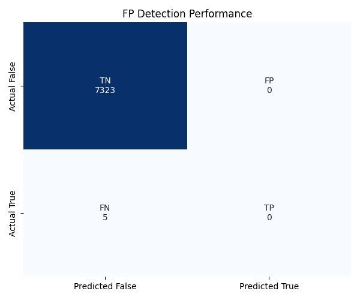

# Metric Report: MetricASabotage_SingleLLM

## Scores
| Metric | Value |
|--------|-------|
| fp_detection_rate | 0.0000 |
| fp_precision | 0.0000 |
| recovery_rate | 0.0000 |
| tp_fp | 0 |
| fn_fp | 5 |
| fp_detector | 0 |

## Plots

